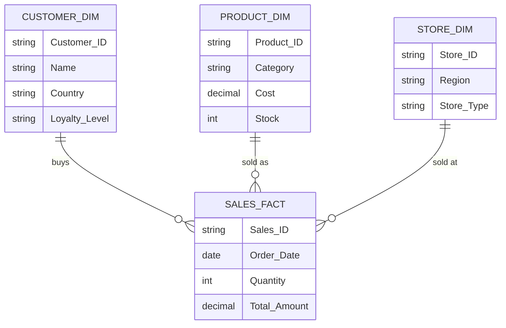
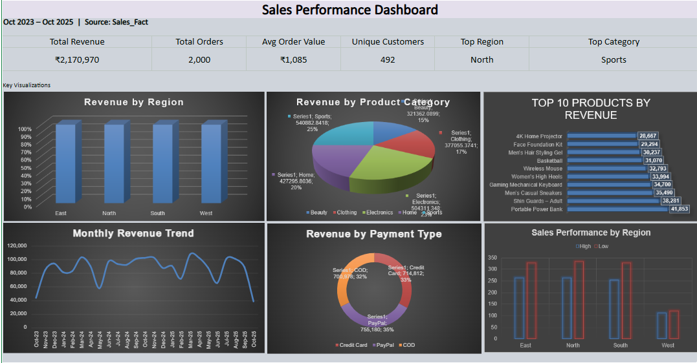
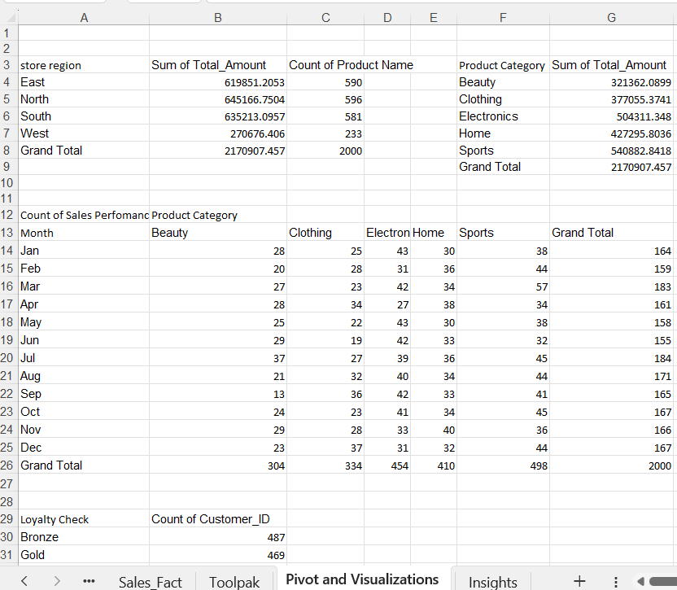

# 🛒 E-Commerce Sales Dashboard
## *A 2,000-Transaction Star Schema — Cleaned, Modeled, and Visualized in Pure Excel*

  

    

 

## 🗺️ Table of Contents

| | | |
|:---:|:---:|:---:|
| 🎯 [Project Overview](#-project-overview) | 🔄 [The Process](#-the-process--how-this-came-together) | 🗂️ [Repository Structure](#-repository-structure) |
| 📊 [Dataset at a Glance](#-dataset-at-a-glance) | 🧭 [Methodology](#-methodology--section-by-section) | 💡 [Key Insights](#-key-insights) |
| 🔥 [Statistical Deep-Dive](#-statistical-deep-dive) | 🏢 [Business Intelligence & Outlook](#-business-intelligence--future-outlook) | 📸 [Visual Gallery](#-visual-gallery) |
| 🐛 [A Bug Worth Talking About](#-a-bug-worth-talking-about) | 🧠 [Skills Applied](#-skills-applied) | 🚀 [About Me](#-about-me) |

---

## 🎯 Project Overview

Every retail business runs on the same three questions: *which region sells the most, which products actually move, and which customers matter most?* This project answers all three from scratch, using a genuine **star schema** built entirely in Excel — one central fact table of 2,000 sales transactions, linked to three dimension tables covering 500 customers, 100 products, and 20 stores.

This wasn't handed over pre-cleaned. Customer names arrived with inconsistent capitalization and stray titles ("Dr.", "MD", "DDS"), country values were spelled three different ways for the same country, ages needed range validation, and several cost, stock, and quantity fields had gaps that needed formula-driven imputation rather than blind deletion. Every one of those fixes was done with live Excel formulas — `VLOOKUP`, `SUMIFS`, `AVERAGEIFS`, `PROPER`/`TRIM`, nested `IF` logic — not manual entry, so the workbook recalculates correctly if the underlying data changes.

From there, the analysis built genuine pivot tables (revenue by region, by category, by month), ran full descriptive statistics through Excel's Analysis ToolPak, and assembled a live dashboard with real KPI cards and six charts. And in checking my own final written insights against the actual pivot output, I caught a real error in my own report — proof that verifying your own numbers matters as much as building the pipeline in the first place.

---

## 🔄 The Process — How This Came Together

### 🧹 Data Cleaning
Customer names and cities arrived with inconsistent casing and formatting — fixed with `=PROPER(TRIM(...))` across both fields. Country values existed in three different spellings ("USA", "usa", "United States of America") and needed standardization through nested `IF` logic. Product IDs had inconsistent prefix formatting depending on their numeric range, corrected with a conditional `TEXT`/`MID` extraction formula. Currency formatting was applied properly to Unit Price and Total Amount instead of leaving them as raw numbers.

### 🔍 Exploration & Validation
Before trusting any KPI, an age validation check flagged any customer outside a plausible 18–70 range using a formula-driven `IF(OR(...))` check rather than manually scanning 500 rows. A full descriptive statistics pass through Excel's **Analysis ToolPak** calculated mean, median, mode, standard deviation, skewness, and kurtosis on Total Amount — turning "the dashboard looks right" into "the dashboard is statistically verified."

### 🧪 Data Imputation & Transformation
Missing cost, stock, and quantity values were never simply deleted — each was imputed using `AVERAGEIFS`/`AVERAGEIF` keyed to the matching category, sub-category, or product, so a missing product's cost was estimated from genuinely similar products rather than a flat guess. Month was extracted from order date using `TEXT(date, "MMM")`, and conditional formatting was layered onto Sales Performance and Order Range columns to visually flag high performers and bulk orders directly in the sheet.

### 🎨 Visualization & Dashboarding
Three pivot tables were built directly from the fact table — sales by region, revenue by category, and a monthly category breakdown — feeding into six live charts (bar, pie, doughnut, line) assembled into a single interactive Dashboard sheet with real KPI cards pulling from `SUM`, `COUNT`, `AVERAGE`, and `MAX` formulas, not hardcoded numbers.

---

## 🗂️ Repository Structure
**The pipeline, visually:**

**The star schema:**

---

## 📊 Dataset at a Glance

| Table | Records | Key Fields |
|---|:---:|---|
| Sales_Fact (fact table) | 2,000 | Order_Date, Quantity, Unit_Price, Discount, Total_Amount, Payment_Type |
| Customer_Dim | 500 | Name, Age, Gender, City, Country, Loyalty_Level |
| Product_Dim | 100 | Product_Name, Category, Sub_Category, Brand, Cost, Stock |
| Store_Dim | 20 | Store_Name, Region, City, Store_Type |
| **Total Revenue** | **$2,170,969.81** | Sum of all Total_Amount |
| **Total Orders** | **2,000** | One row per transaction |
| **Avg Order Value** | **$1,085.48** | Total Revenue ÷ Total Orders |
| **Unique Customers** | **492** | Distinct customers who purchased |
| **Top Region** | **North** | By total revenue |
| **Top Category** | **Sports** | By total revenue |

---

## 🧭 Methodology — Section by Section

**1. Data Import & Table Creation**
Loaded four related tables — Customer_Dim, Product_Dim, Store_Dim, and Sales_Fact — and formatted each as a proper Excel Table so formulas and pivot references stay stable as data grows. This structural choice mattered later: every VLOOKUP and pivot table downstream depends on these being genuine tables, not just formatted ranges.

**2. Data Cleaning**
Standardized Name and City fields across all dimension tables using `PROPER(TRIM(...))` to fix inconsistent capitalization and stray whitespace in one pass. Corrected country spelling inconsistencies ("USA" vs "usa" vs "United States of America") with nested conditional logic, and fixed inconsistent Product ID prefixes using a conditional TEXT/MID extraction. Replaced the literal string "Unknown" appearing inconsistently in Product Name using Find & Replace, and applied proper currency formatting to every monetary field.

**3. Data Imputation**
Rather than dropping rows with missing values — a real risk with only 2,000 total transactions — missing Cost and Stock values were imputed using `AVERAGEIFS` keyed to matching Category and Sub-Category, and missing Quantity was imputed using `AVERAGEIF` keyed to the specific Product ID. Missing Loyalty Level was explicitly imputed as "Standard" rather than left blank, ensuring every downstream pivot table and groupby has a complete category to work with.

**4. Data Transformation & Joins**
Used `VLOOKUP` extensively to pull Customer Name, Product Category, Product Name, Store Region, and Loyalty Level directly into the Sales_Fact table, turning three separate dimension tables and one fact table into a single analysis-ready view. Extracted Month from Order Date using `TEXT(date, "MMM")`, and built Sales Performance and Order Range flags using nested `IF` logic to classify each transaction as High/Low performance or a bulk order.

**5. Descriptive Statistics**
Ran Excel's Analysis ToolPak on Total_Amount across all 2,000 transactions, producing mean, median, standard deviation, skewness, and kurtosis in one pass. The standout finding: a skewness of **0.886**, confirming the revenue distribution is meaningfully right-skewed — a small number of high-value orders pull the average well above the median, exactly the kind of insight a simple average alone would hide.

**6. Visualization & Dashboard Assembly**
Built three core pivot tables — sales by store region, revenue by product category, and a full month-by-category breakdown — then assembled six charts (bar, pie, doughnut, line, and 3D variants) into a single Dashboard sheet with live KPI cards computed via `SUM`, `COUNT`, `AVERAGE`, and `MAX` formulas rather than hardcoded values, so the entire dashboard recalculates if the underlying Sales_Fact data changes.

---

## 💡 Key Insights

- **Sports is the strongest category by a clear margin** — contributing $540,882.84 in total revenue, ahead of Electronics ($504,311.35), Home ($427,295.80), Clothing ($377,055.37), and Beauty ($321,362.09).
- **Regional performance is far from even** — North ($645,166.75), South ($635,213.10), and East ($619,851.21) perform similarly, while West trails meaningfully behind at just $270,676.41, roughly 42% of the top region's revenue.
- **Order values are right-skewed, not normally distributed** — a skewness of 0.886 means a subset of large orders is pulling the $1,085.48 average well above the $866.70 median, a distinction that matters when setting revenue targets based on "the average order."
- **Platinum customers dominate the loyalty base** — 606 transactions came from Platinum-tier customers, more than Bronze (487) and Gold (469) combined with room to spare, suggesting loyalty tier genuinely correlates with purchase frequency.
- **My own written report contained a real numerical error** — the insights summary claimed North region generated $451,616.75, but the verified pivot table shows **$645,166.75**, a difference of roughly $193,550. West's stated figure, by contrast, matched the real data exactly — proof that even a careful analysis needs its own conclusions checked against the source data before publishing.

---

## 🔥 Statistical Deep-Dive

| Statistic | Value | What It Tells Us |
|---|:---:|---|
| Mean | $1,085.48 | The simple average across all 2,000 orders |
| Median | $866.70 | Notably lower than the mean — a sign of skew |
| Standard Deviation | $819.07 | Substantial spread around the average order size |
| Skewness | 0.886 | Meaningfully right-skewed — high-value orders pull the average up |
| Kurtosis | 0.063 | Close to a normal distribution's tail thickness, despite the skew |
| Minimum | $18.46 | The smallest single transaction recorded |
| Maximum | $3,908.24 | The largest single transaction — over 3.5x the mean |

**Reading between the numbers:** the mean sitting nearly $219 above the median is the clearest signal in this entire dataset. It means "average order value" alone would overstate what a typical customer actually spends — median is the more honest number for setting realistic expectations, while the mean is more useful for total revenue forecasting.

---

## 🏢 Business Intelligence & Future Outlook

The regional gap is the single most actionable finding here: West generating only 42% of North's revenue isn't a rounding difference, it's a signal that either the West region is under-resourced, under-marketed, or serving a genuinely smaller customer base — and each of those has a completely different fix. Meanwhile, Sports leading every other category by a wide margin suggests concentrated demand worth doubling down on with inventory and marketing focus, rather than spreading investment evenly across all five categories.

The right-skewed order value distribution has a direct pricing and marketing implication: a strategy built around "increase the average order value" should specifically target pushing more customers into higher-value baskets (bundling, upsells) rather than assuming uniform spending across the customer base. Looking ahead, the natural next step is layering **customer lifetime value analysis** on top of the existing Loyalty_Level breakdown, and building a **Power BI or dashboard-linked forecasting model** using the monthly category pivot as a base — turning this static Excel dashboard into a live, refreshable reporting tool.

---

## 📸 Visual Gallery

### 1️⃣ Sales Performance Dashboard

*The live Dashboard sheet — KPI cards for Total Revenue, Total Orders, Average Order Value, Unique Customers, Top Region, and Top Category, all computed via formulas rather than hardcoded values, so every number updates automatically if the underlying Sales_Fact data changes.*

### 2️⃣ Pivot Tables — Region, Category & Monthly Breakdown

*The core pivot tables driving every chart in the dashboard — sales by store region, revenue by product category, and a full month-by-category count breakdown, plus a loyalty-level customer count table.*

---

## 🐛 A Bug Worth Talking About

While verifying the `Clean Country` formula in `Customer_Dim`, I found a genuine formula error, not just a stylistic issue. The formula reads:

There's a stray `K5` reference broken into the middle of the formula — almost certainly a copy-paste artifact — which corrupts the nested logic. The real-world effect: for the one customer record where Country was entered as `"United States of America"`, the `Clean Country` column returns a literal `#VALUE!` error instead of the intended `"USA"`. I verified this directly against the live data rather than just reading the formula and assuming it was fine — the broken cell is confirmed sitting in the workbook. Every other customer record happened to use "USA" or "usa" directly, so this bug stayed invisible until that one edge case was checked specifically. It's a useful reminder that a formula "working" for 499 out of 500 rows isn't the same as a formula being *correct*.

---

## 🧠 Skills Applied

- **Formula-Driven Data Cleaning** — using `PROPER`, `TRIM`, nested `IF`, and conditional `TEXT`/`MID` extraction to standardize messy real-world text fields instead of manually retyping values.
- **Relational Thinking in Excel** — building and maintaining a genuine star schema (one fact table, three dimensions) joined entirely through `VLOOKUP`, the same conceptual model that underlies SQL joins and Power BI data models.
- **Imputation Over Deletion** — using `AVERAGEIFS`/`AVERAGEIF` to fill missing cost, stock, and quantity values based on genuinely similar records, preserving every one of the 2,000 transactions rather than discarding data.
- **Verifying Your Own Conclusions** — catching a $193K error in my own written insights by checking every stated figure against the underlying pivot table, rather than trusting a first-pass summary.

---

## 🚀 About Me

I'm **Bernad** — transitioning from a background in medical billing into data analytics, one hands-on project at a time. B.Sc. in Mathematics, and a firm believer that a dashboard is only as trustworthy as the formulas underneath it.

| 🔧 Skill Area | 🌟 Tools |
|---|---|
| 📊 Spreadsheet Analysis | Excel (VLOOKUP, SUMIFS, AVERAGEIFS, Pivot Tables, Analysis ToolPak) |
| 🗄️ Business Intelligence | Power BI, DAX, Power Query |
| 🐍 Programming | Python, Pandas, NumPy |
| 📈 Visualization | Matplotlib, Seaborn, Plotly |
| 🗃️ Data Querying | SQL |
| 🧠 Core Strength | Verifying Numbers Before Trusting Them |

My approach is simple: **clean before I visualize, question the data before I trust it, and check my own conclusions against the source before calling anything finished** — because that's genuinely how I learn to trust my own work.

---

## 📫 Let's Connect

⭐ **If this project helped you see how a real star schema comes together in plain Excel, a star would mean a lot.**

